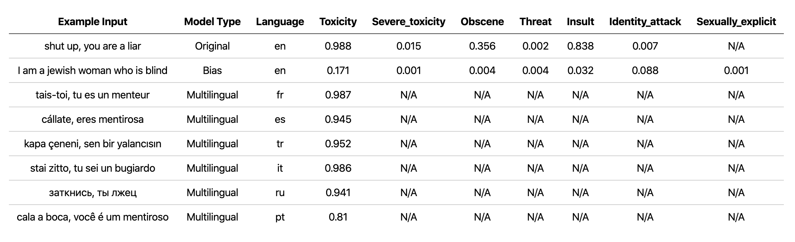

<div align="center">

# 🙊 Detoxify
##  Toxic Comment Classification with ⚡ Pytorch Lightning and 🤗 Transformers

[](https://badge.fury.io/py/detoxify)


</div>



## News & Updates

### 22-10-2021: New improved multilingual model & standardised class names
-  Updated the `multilingual` model weights used by Detoxify with a model trained on the translated data from the 2nd Jigsaw challenge (as well as the 1st). This model has also been trained to minimise bias and now returns the same categories as the `unbiased` model. New best AUC score on the test set: 92.11 (89.71 before).
- All detoxify models now return consistent class names (e.g. "identity_attack" replaces "identity_hate" in the `original` model to match the `unbiased` classes).

### 03-09-2021: New improved unbiased model
-  Updated the `unbiased` model weights used by Detoxify with a model trained on both datasets from the first 2 Jigsaw challenges. New best score on the test set: 93.74 (93.64 before).

### 15-02-2021: Detoxify featured in Scientific American!
- Our opinion piece ["Can AI identify toxic online content?"](https://www.scientificamerican.com/article/can-ai-identify-toxic-online-content/) is now live on Scientific American

### 14-01-2021: Lightweight models

- Added smaller models trained with Albert for the `original` and `unbiased` models! Can access these in the same way with detoxify using `original-small` and `unbiased-small` as inputs. The `original-small` achieved a mean AUC score of 98.28 (98.64 before) and the `unbiased-small` achieved a final score of 93.36 (93.64 before).

## Description

Trained models & code to predict toxic comments on 3 Jigsaw challenges: Toxic comment classification, Unintended Bias in Toxic comments, Multilingual toxic comment classification.

Built by [Laura Hanu](https://laurahanu.github.io/) at [Unitary](https://www.unitary.ai/), where we are working to stop harmful content online by interpreting visual content in context.

Dependencies:
- For inference:
  - 🤗 Transformers
  - ⚡ Pytorch lightning
- For training will also need:
  - Kaggle API (to download data)


| Challenge | Year | Goal | Original Data Source | Detoxify Model Name | Top Kaggle Leaderboard Score % | Detoxify Score %
|-|-|-|-|-|-|-|
| [Toxic Comment Classification Challenge](https://www.kaggle.com/c/jigsaw-toxic-comment-classification-challenge) | 2018 |  build a multi-headed model that’s capable of detecting different types of of toxicity like threats, obscenity, insults, and identity-based hate. | Wikipedia Comments | `original` | 98.86 | 98.64
| [Jigsaw Unintended Bias in Toxicity Classification](https://www.kaggle.com/c/jigsaw-unintended-bias-in-toxicity-classification) | 2019 | build a model that recognizes toxicity and minimizes this type of unintended bias with respect to mentions of identities. You'll be using a dataset labeled for identity mentions and optimizing a metric designed to measure unintended bias. | Civil Comments | `unbiased` | 94.73 | 93.74
| [Jigsaw Multilingual Toxic Comment Classification](https://www.kaggle.com/c/jigsaw-multilingual-toxic-comment-classification) | 2020 | build effective multilingual models | Wikipedia Comments + Civil Comments | `multilingual` | 95.36 | 92.11


It is also noteworthy to mention that the top leadearboard scores have been achieved using model ensembles. The purpose of this library was to build something user-friendly and straightforward to use.

### Multilingual model language breakdown

| Language Subgroup   |   Subgroup size |   Subgroup AUC Score % |
|:-----------|----------------:|---------------:|
🇮🇹 it       |     8494   |   89.18 |
🇫🇷 fr      |    10920   |   89.61 |
🇷🇺 ru     |    10948   |   89.81 |
🇵🇹 pt      |    11012   |   91.00 |
🇪🇸 es      |     8438   |   92.74 |
🇹🇷 tr     |    14000   |   97.19 |

## Limitations and ethical considerations

If words that are associated with swearing, insults or profanity are present in a comment, it is likely that it will be classified as toxic, regardless of the tone or the intent of the author e.g. humorous/self-deprecating. This could present some biases towards already vulnerable minority groups.

The intended use of this library is for research purposes, fine-tuning on carefully constructed datasets that reflect real world demographics  and/or to aid content moderators in flagging out harmful content quicker.

Some useful resources about the risk of different biases in toxicity or hate speech detection are:
- [The Risk of Racial Bias in Hate Speech Detection](https://homes.cs.washington.edu/~msap/pdfs/sap2019risk.pdf)
- [Automated Hate Speech Detection and the Problem of Offensive Language](https://arxiv.org/pdf/1703.04009.pdf%201.pdf)
- [Racial Bias in Hate Speech and Abusive Language Detection Datasets](https://arxiv.org/pdf/1905.12516.pdf)

## Quick prediction


The `multilingual` model has been trained on 7 different languages so it should only be tested on: `english`, `french`, `spanish`, `italian`, `portuguese`, `turkish` or `russian`.

```bash
# install detoxify

pip install detoxify

```
```python

from detoxify import Detoxify

# each model takes in either a string or a list of strings

results = Detoxify('original').predict('example text')

results = Detoxify('unbiased').predict(['example text 1','example text 2'])

results = Detoxify('multilingual').predict(['example text','exemple de texte','texto de ejemplo','testo di esempio','texto de exemplo','örnek metin','пример текста'])

# to specify the device the model will be allocated on (defaults to cpu), accepts any torch.device input

model = Detoxify('original', device='cuda')

# optional to display results nicely (will need to pip install pandas)

import pandas as pd

print(pd.DataFrame(results, index=input_text).round(5))

```
For more details check the Prediction section.


## Labels
All challenges have a toxicity label. The toxicity labels represent the aggregate ratings of up to 10 annotators according the following schema:
- **Very Toxic** (a very hateful, aggressive, or disrespectful comment that is very likely to make you leave a discussion or give up on sharing your perspective)
- **Toxic** (a rude, disrespectful, or unreasonable comment that is somewhat likely to make you leave a discussion or give up on sharing your perspective)
- **Hard to Say**
- **Not Toxic**

More information about the labelling schema can be found [here](https://www.kaggle.com/c/jigsaw-unintended-bias-in-toxicity-classification/data).

### Toxic Comment Classification Challenge
This challenge includes the following labels:

- `toxic`
- `severe_toxic`
- `obscene`
- `threat`
- `insult`
- `identity_hate`

### Jigsaw Unintended Bias in Toxicity Classification
This challenge has 2 types of labels: the main toxicity labels and some additional identity labels that represent the identities mentioned in the comments.

Only identities with more than 500 examples in the test set (combined public and private) are included during training as additional labels and in the evaluation calculation.

- `toxicity`
- `severe_toxicity`
- `obscene`
- `threat`
- `insult`
- `identity_attack`
- `sexual_explicit`

Identity labels used:
- `male`
- `female`
- `homosexual_gay_or_lesbian`
- `christian`
- `jewish`
- `muslim`
- `black`
- `white`
- `psychiatric_or_mental_illness`

A complete list of all the identity labels available can be found [here](https://www.kaggle.com/c/jigsaw-unintended-bias-in-toxicity-classification/data).


### Jigsaw Multilingual Toxic Comment Classification

Since this challenge combines the data from the previous 2 challenges, it includes all labels from above, however the final evaluation is only on:

- `toxicity`

## How to run

First, install dependencies
```bash
# clone project

git clone https://github.com/unitaryai/detoxify

# create virtual env

python3 -m venv toxic-env
source toxic-env/bin/activate

# install project

pip install -e detoxify
cd detoxify

# for training
pip install -r requirements.txt

 ```

## Prediction

Trained models summary:

|Model name| Transformer type| Data from
|:--:|:--:|:--:|
|`original`| `bert-base-uncased` | Toxic Comment Classification Challenge
|`unbiased`| `roberta-base`| Unintended Bias in Toxicity Classification
|`multilingual`| `xlm-roberta-base`| Multilingual Toxic Comment Classification

For a quick prediction can run the example script on a comment directly or from a txt containing a list of comments.
```bash

# load model via torch.hub

python run_prediction.py --input 'example' --model_name original

# load model from from checkpoint path

python run_prediction.py --input 'example' --from_ckpt_path model_path

# save results to a .csv file

python run_prediction.py --input test_set.txt --model_name original --save_to results.csv

# to see usage

python run_prediction.py --help

```

Checkpoints can be downloaded from the latest release or via the Pytorch hub API with the following names:
- `toxic_bert`
- `unbiased_toxic_roberta`
- `multilingual_toxic_xlm_r`
```bash
model = torch.hub.load('unitaryai/detoxify','toxic_bert')
```

Importing detoxify in python:

```python

from detoxify import Detoxify

results = Detoxify('original').predict('some text')

results = Detoxify('unbiased').predict(['example text 1','example text 2'])

results = Detoxify('multilingual').predict(['example text','exemple de texte','texto de ejemplo','testo di esempio','texto de exemplo','örnek metin','пример текста'])

# to display results nicely

import pandas as pd

print(pd.DataFrame(results,index=input_text).round(5))

```


## Training

 If you do not already have a Kaggle account:
 - you need to create one to be able to download the data

 - go to My Account and click on Create New API Token - this will download a kaggle.json file

 - make sure this file is located in ~/.kaggle

 ```bash

# create data directory

mkdir jigsaw_data
cd jigsaw_data

# download data

kaggle competitions download -c jigsaw-toxic-comment-classification-challenge

kaggle competitions download -c jigsaw-unintended-bias-in-toxicity-classification

kaggle competitions download -c jigsaw-multilingual-toxic-comment-classification

```
## Start Training
 ### Toxic Comment Classification Challenge

 ```bash

# combine test.csv and test_labels.csv
python preprocessing_utils.py --test_csv jigsaw_data/jigsaw-toxic-comment-classification-challenge/test.csv --update_test

python train.py --config configs/Toxic_comment_classification_BERT.json
```
 ### Unintended Bias in Toxicicity Challenge

```bash

python train.py --config configs/Unintended_bias_toxic_comment_classification_RoBERTa_combined.json

```
 ### Multilingual Toxic Comment Classification


 The translated data ([source 1](https://www.kaggle.com/miklgr500/jigsaw-train-multilingual-coments-google-api) [source 2](https://www.kaggle.com/ludovick/jigsawtanslatedgoogle)) can be downloaded from Kaggle in french, spanish, italian, portuguese, turkish, and russian (the languages available in the test set).


```bash

# combine test.csv and test_labels.csv
python preprocessing_utils.py --test_csv jigsaw_data/jigsaw-multilingual-toxic-comment-classification/test.csv --update_test

python train.py --config configs/Multilingual_toxic_comment_classification_XLMR.json

```

### Monitor progress with tensorboard

 ```bash

tensorboard --logdir=./saved

```
## Model Evaluation

### Toxic Comment Classification Challenge

This challenge is evaluated on the mean AUC score of all the labels.

```bash

python evaluate.py --checkpoint saved/lightning_logs/checkpoints/example_checkpoint.pth --test_csv test.csv

```
### Unintended Bias in Toxicicity Challenge

This challenge is evaluated on a novel bias metric that combines different AUC scores to balance overall performance. More information on this metric [here](https://www.kaggle.com/c/jigsaw-unintended-bias-in-toxicity-classification/overview/evaluation).

```bash

python evaluate.py --checkpoint saved/lightning_logs/checkpoints/example_checkpoint.pth --test_csv test.csv

# to get the final bias metric
python model_eval/compute_bias_metric.py

```
### Multilingual Toxic Comment Classification

This challenge is evaluated on the AUC score of the main toxic label.

```bash

python evaluate.py --checkpoint saved/lightning_logs/checkpoints/example_checkpoint.pth --test_csv test.csv

```

### Citation
```
@misc{Detoxify,
  title={Detoxify},
  author={Hanu, Laura and {Unitary team}},
  howpublished={Github. https://github.com/unitaryai/detoxify},
  year={2020}
}
```
